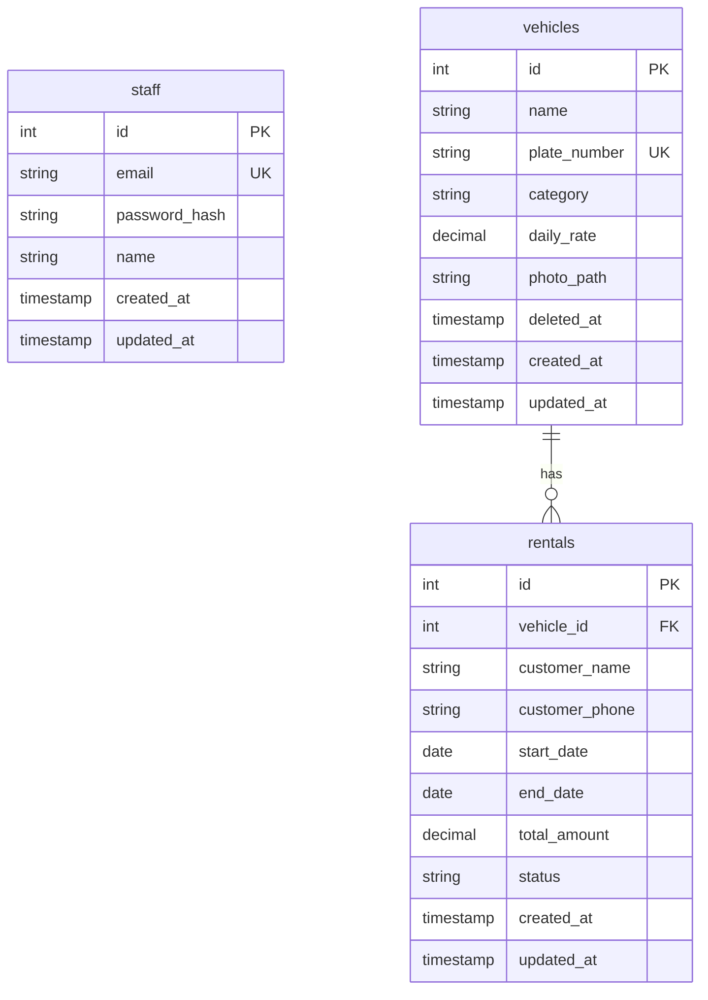

# Vehicle Rental Management System (Backend REST API)

An enterprise-grade, highly scalable, and modular REST API backend for a Vehicle Rental Management System. This system allows rental company staff to log in and manage the vehicle fleet, records customer bookings as rentals (with strict collision prevention), and provides detailed monthly rental activity reporting.

The system is architected around Node.js, TypeScript, PostgreSQL (with Knex.js), and features high-concurrency availability checks using Redis, search/filtering via OpenSearch, Cloudinary image hosting, and event-driven logging/processing using Apache Kafka.

---

## Table of Contents
- [Features](#features)
- [System Architecture](#system-architecture)
- [Tech Stack](#tech-stack)
- [Project Structure](#project-structure)
- [Database Schema](#database-schema)
- [API Documentation](#api-documentation)
  - [Authentication](#authentication)
  - [Vehicles](#vehicles)
  - [Rentals](#rentals)
  - [Reports](#reports)
- [Business Logic & Technical Decisions](#business-logic--technical-decisions)
  - [Date Overlap Collision Prevention](#date-overlap-collision-prevention)
  - [Pro-Rata Monthly Report Calculation](#pro-rata-monthly-report-calculation)
- [Setup & Installation](#setup--installation)
  - [Prerequisites](#prerequisites)
  - [Environment Variables](#environment-variables)
  - [Docker & External Services Setup](#docker--external-services-setup)
  - [Database Migrations & Seeds](#database-migrations--seeds)
  - [Running the Application](#running-the-application)
- [Development & Quality Standards](#development-quality-standards)

---

## Features

- **Authentication & Security:** Multi-device staff login with Bcrypt password hashing, dual JWT tokens (Access Token & Refresh Token), RFC-compliant UUIDv7 `deviceId`, and active session tracking in Redis.
- **Vehicle Fleet Management:** CRUD operations for vehicles with multipart form-data photo uploads streamed directly to **Cloudinary**. Features soft deletion (`deleted_at`) to preserve relational integrity.
- **Cursor Pagination:** `GET /vehicles` implements lightweight, fast cursor pagination returning `nextCursor` in response payloads.
- **Advanced Search & Filtering:** Vehicle search by name, category, and plate number is accelerated using **OpenSearch** to offload database search queries.
- **Booking Engine:** Rental booking with transactional overlap protection (prevents double-booking under race conditions). Total rental amount is calculated server-side based on the vehicle's daily rate.
- **Pro-Rata Monthly Reporting:** Calculates occupancy metrics (total bookings, days rented, revenue) broken down per vehicle for a requested calendar month, ensuring cross-month rentals are pro-rated accurately.
- **High Concurrency & Event Handling:**
  - **Redis Caching:** Individual vehicle details (`vehicle:{id}`) and Sorted Set index pagination (`vehicles:index` & `vehicles:index:{category}`) are cached in Redis.
  - **Kafka Integration:** Asynchronous event handling for booking creations (`rental.created`).

---

## System Architecture

The project follows a **Modular Feature Architecture** combined with a clean **OOP (Object-Oriented Programming)** structure.

```
                  ┌─────────────────────────────────┐
                  │          Client / HTTP          │
                  └────────────────┬────────────────┘
                                   │ (Express.js Routes)
                                   ▼
                  ┌─────────────────────────────────┐
                  │    Controllers (HTTP Parsing)   │
                  └────────────────┬────────────────┘
                                   │
                                   ▼
                  ┌─────────────────────────────────┐
                  │   Services (Business Logic)     │
                  └──────┬─────────┬───────────┬────┘
                         │         │           │
                         ▼         ▼           ▼
                  ┌──────────┐ ┌────────┐ ┌───────────┐
                  │   Redis  │ │  Kafka │ │OpenSearch │
                  │ (Cache)  │ │(Events)│ │ (Search)  │
                  └──────────┘ └────────┘ └───────────┘
                         │
                         ▼
                  ┌─────────────────────────────────┐
                  │   Repositories (Data Access)    │
                  └────────────────┬────────────────┘
                                   │ (Knex.js)
                                   ▼
                  ┌─────────────────────────────────┐
                  │      PostgreSQL Database        │
                  └─────────────────────────────────┘
```

- **Modular Design:** Each domain (`auth`, `vehicles`, `rentals`, `reports`) is grouped together in `src/modules/` containing its controller, service, repository, interface, routes, and validation schemas.
- **Service Layer (OOP):** Route handlers delegate all business execution to Service classes. No business logic is placed inside the controller or routing layer.
- **Repository Pattern:** Database queries (SQL/Knex) are completely abstracted away from the Service layer into Repository classes.
- **Isolated Cache Layer:** Domain-specific cache operations are encapsulated in `AuthCache` and `VehiclesCache` wrapper classes.
- **Transactional Consistency:** Rental availability checks and insert operations are wrapped in PostgreSQL transactions (`Serializable` or explicit locking) to ensure race-free execution.

---

## Tech Stack

- **Runtime:** Node.js (v20+ LTS)
- **Language:** TypeScript
- **Framework:** Express.js
- **Query Builder & DB:** Knex.js & PostgreSQL
- **Caching:** Redis (Node-Redis) & RedisInsight UI
- **Search Engine:** OpenSearch
- **Message Broker:** Apache Kafka
- **Validation:** Joi
- **File Storage:** Multer (Memory Storage) & Cloudinary SDK
- **Authentication:** JWT (Access & Refresh secrets) & Bcrypt
- **API Documentation:** Swagger / OpenAPI
- **Linter/Formatter:** ESLint & Prettier

---

## Project Structure

```text
src/
├── server.ts                 # HTTP Server Entry Point
├── worker.ts                 # Kafka Worker/Consumer Entry Point
├── app.ts                    # Express App Setup
├── app.container.ts          # Dependency Injection / Container
├── config/                   # Centralized configuration setup
│   ├── cloudinary.ts         # Cloudinary SDK Client config
│   ├── db.ts                 # Knex Connection Pool config
│   ├── env.ts                # Environment Variable validation (Joi)
│   ├── kafka.ts              # Kafka Connection Client
│   ├── opensearch.ts         # OpenSearch Connection Client
│   ├── redis.ts              # Redis Connection Client
│   └── swagger.ts            # Swagger UI route setup
├── database/                 # Database migrations and seed scripts
│   ├── migrations/
│   └── seeds/
├── docs/                     # Swagger API documentation
│   └── swagger.json
├── kafka/                    # Event-driven worker infrastructure
│   ├── handlers/
│   │   └── rental_event.handler.ts
│   └── worker.ts             # Kafka Consumer Orchestrator
├── middleware/               # Common HTTP Middlewares
│   ├── auth.middleware.ts    # JWT verification & Redis session check
│   ├── error.middleware.ts   # Global error handling
│   ├── upload.middleware.ts  # Multer memory storage middleware
│   └── validation.middleware.ts # Joi request body validator
├── modules/                  # Modular Feature Domains
│   ├── auth/                 # Authentication & Multi-Device Sessions
│   ├── vehicles/             # Vehicle Management, Caching & Search
│   ├── rentals/              # Rental / Booking Processing
│   └── reports/              # Monthly activity analytics
└── utils/                    # Shared utility classes
    ├── appError.ts           # Standard Custom AppError wrapper
    ├── cloudinary.ts         # Cloudinary upload & delete stream helpers
    ├── sendResponse.ts       # Standard JSON response structure
    └── uuid.ts               # RFC-compliant UUIDv7 generator
```

---

## Database Schema



### Table Definitions

1. **`staff`**
   - Holds staff credentials and details for dashboard authentication.
2. **`vehicles`**
   - Represents the fleet. Features soft delete support using `deleted_at`. Deleted vehicles are excluded from general rentals and list responses, but retained in database relations.
3. **`rentals`**
   - Logs customer booking details.
   - Status states: `'booked'`, `'ongoing'`, `'completed'`, `'cancelled'`.

---

## API Documentation

Protected routes require JWT bearer token in header: `Authorization: Bearer <accessToken>`.

### Authentication
- `POST /api/auth/login`
  - **Body:** `{ email, password, deviceName }` (`deviceName` optional)
  - **Response:** `{ accessToken, refreshToken, deviceId, staff: { id, email, name } }`
  - **Note:** Generates a unique UUIDv7 session `deviceId` and supports concurrent device logins. Saves session details in Redis (`session:staff:{id}:{deviceId}`).

### Vehicles
- `GET /api/vehicles` (Public)
  - **Query Parameters:** `cursor` (number), `limit` (number), `category` (string), `search` (string)
  - **Response:**
    ```json
    {
      "success": true,
      "message": "Vehicles list fetched successfully",
      "data": {
        "vehicles": [
          {
            "id": 1,
            "name": "Tesla Model S",
            "plate_number": "XYZ-789",
            "category": "Sedan",
            "daily_rate": 120,
            "photo_path": "https://res.cloudinary.com/demo/image/upload/sample.jpg",
            "created_at": "2026-08-09T14:30:00.000Z",
            "updated_at": "2026-08-09T14:30:00.000Z"
          }
        ],
        "nextCursor": 2
      }
    }
    ```
  - **Note:** Uses Redis ZSET (`vehicles:index` & `vehicles:index:{category}`) for fast cursor pagination and OpenSearch for fuzzy text search across `name`, `category`, and `plate_number`.

- `GET /api/vehicles/:id` (Public)
  - **Response:** Vehicle object fetched from Redis `vehicle:{id}` details cache or database.

- `POST /api/vehicles` (Staff Only)
  - **Headers:** `Content-Type: multipart/form-data`
  - **Body:** `name`, `plate_number`, `category`, `daily_rate` + optional file `photo`.
  - **Action:** Validates uniqueness of plate number, streams image buffer to Cloudinary, creates PostgreSQL record, caches details in Redis, updates ZSET index (if hydrated), and indexes document in OpenSearch.

- `PUT /api/vehicles/:id` (Staff Only)
  - **Headers:** `Content-Type: multipart/form-data`
  - **Body:** Optional fields `name`, `plate_number`, `category`, `daily_rate` + optional file `photo`.
  - **Action:** Updates PostgreSQL record, optionally uploads new photo to Cloudinary, updates Redis details cache & category ZSETs safely (verifying `indexExists`), and updates OpenSearch document.

- `DELETE /api/vehicles/:id` (Staff Only)
  - **Action:** Soft-deletes vehicle by setting `deleted_at = NOW()`, purges Redis details cache, removes vehicle ID from hydrated ZSET indexes, and deletes document from OpenSearch index.

### Rentals
- `GET /rentals`
  - **Parameters:** `vehicle_id`, `status`, `start_date`, `end_date`, `page`, `limit`
- `GET /rentals/:id`
  - **Response:** Detailed rental object with vehicle details.
- `POST /rentals`
  - **Body:** `{ vehicle_id, customer_name, customer_phone, start_date, end_date }`
  - **Action:** Computes `total_amount` server-side (based on vehicle `daily_rate`). Returns `409 Conflict` if the vehicle is already booked for overlapping dates.
  - **Bonus:** Availability check and creation run inside a serialized database transaction.
- `PUT /rentals/:id`
  - **Body:** Updates fields (e.g., date adjustments or status updates). Triggers date overlap checking if dates are changed.
- `DELETE /rentals/:id`
  - **Action:** Hard-delete of a rental record.

### Reports
- `GET /reports/rentals?month=YYYY-MM&vehicle_id=123`
  - **Parameters:** `month` (Required, format `YYYY-MM`), `vehicle_id` (Optional filter)
  - **Response:**
    ```json
    {
      "month": "2026-08",
      "data": [
        {
          "vehicle_id": 1,
          "name": "Tesla Model 3",
          "total_bookings": 3,
          "days_rented": 12,
          "revenue": 1440.00
        }
      ],
      "highest_revenue_vehicle": {
        "vehicle_id": 1,
        "name": "Tesla Model 3",
        "revenue": 1440.00
      }
    }
    ```

---

## Business Logic & Technical Decisions

### Date Overlap Collision Prevention

Two rental periods conflict if they overlap and both bookings are active (statuses other than `cancelled`). 

Given a requested date range `[S_new, E_new]`, a conflict exists with an existing rental `[S_old, E_old]` if:
```sql
S_new <= E_old AND E_new >= S_old
```

#### Overlap Check Query (Knex/SQL):
```typescript
const overlappingRentals = await trx('rentals')
  .where('vehicle_id', vehicleId)
  .whereNot('status', 'cancelled')
  .where((builder) => {
    builder.where('start_date', '<=', end_date)
           .andWhere('end_date', '>=', start_date);
  })
  .andWhereNot('id', currentRentalId || -1);
```
**Transaction Wrapper:** Wrap this query and the subsequent `INSERT`/`UPDATE` in an explicit database transaction with a locking mechanism (`FOR UPDATE` on target vehicle row or isolation level `SERIALIZABLE`) to avoid race conditions.

---

### Pro-Rata Monthly Report Calculation

When a rental crosses month boundaries (e.g., July 29 to August 3), the reporting query must only count the days and revenue that fall within the requested month. 

- **Requested Month Start:** `M_start` (e.g., `2026-08-01`)
- **Requested Month End:** `M_end` (e.g., `2026-08-31`)
- **Actual Rental Start:** `R_start` (e.g., `2026-07-29`)
- **Actual Rental End:** `R_end` (e.g., `2026-08-03`)

The overlapping range within the month is determined by:
- **Overlapping Start:** `GREATEST(R_start, M_start)`
- **Overlapping End:** `LEAST(R_end, M_end)`

The number of rented days within the target month is:
```sql
GREATEST(0, (LEAST(end_date, :month_end) - GREATEST(start_date, :month_start)) + 1)
```

#### Report Query (PostgreSQL SQL):
```sql
SELECT 
    v.id AS vehicle_id,
    v.name,
    COUNT(r.id) AS total_bookings,
    SUM(
        (LEAST(r.end_date, :month_end) - GREATEST(r.start_date, :month_start)) + 1
    ) AS days_rented,
    SUM(
        ((LEAST(r.end_date, :month_end) - GREATEST(r.start_date, :month_start)) + 1) * v.daily_rate
    ) AS revenue
FROM vehicles v
JOIN rentals r ON v.id = r.vehicle_id
WHERE 
    r.status != 'cancelled'
    AND r.start_date <= :month_end
    AND r.end_date >= :month_start
GROUP BY v.id, v.name;
```

---

## Setup & Installation

### Prerequisites
- Node.js (v20 or higher)
- Docker & Docker Compose (Recommended for running services locally)

### Environment Variables

Create a `.env` file in the root directory. You can copy the structure from `.env.example`:

```bash
cp .env.example .env
```

Define configuration variables inside `.env`:

```env
# Server Config
PORT=3000
NODE_ENV=development
JWT_ACCESS_SECRET=your_access_token_secret_key
JWT_REFRESH_SECRET=your_refresh_token_secret_key
UPLOAD_PATH=uploads/

# Database Config (PostgreSQL)
DB_HOST=127.0.0.1
DB_PORT=5432
DB_USER=postgres
DB_PASSWORD=postgres
DB_NAME=vehicle_rental_db
DB_POOL_MIN=2
DB_POOL_MAX=10

# Redis Cache Config
REDIS_HOST=127.0.0.1
REDIS_PORT=6379
REDIS_PASSWORD=

# OpenSearch Config
OPENSEARCH_NODE=http://127.0.0.1:9200
OPENSEARCH_USER=admin
OPENSEARCH_PASSWORD=admin

# Kafka Broker Config
KAFKA_CLIENT_ID=rental-service
KAFKA_BROKERS=127.0.0.1:9092
KAFKA_TOPIC=rental-events
KAFKA_GROUP_ID=rental-group

# Cloudinary Config
CLOUDINARY_CLOUD_NAME=your_cloud_name
CLOUDINARY_API_KEY=your_api_key
CLOUDINARY_API_SECRET=your_api_secret
```

---

### Docker & External Services Setup

For local development, start all containers (PostgreSQL, Redis, RedisInsight, OpenSearch, Kafka, App, Worker) using Docker Compose:

```bash
docker compose up --build -d
```

---

### Database Migrations & Seeds

1. **Run Migrations:**
   ```bash
   npm run db:migrate
   ```
2. **Seed Database:**
   ```bash
   npm run db:seed
   ```
   *The seeds automatically insert:*
   - One administrator account (`admin@rental.com` / `Password123`)
   - 5 sample vehicles of various categories (SUV, Sedan, Electric)
   - Cross-month bookings (e.g. July 28 to August 3) to test month-boundary calculations in reports.

---

### Running the Application

First, install dependencies:
```bash
npm install
```

#### Run in Development Mode
Start both the main REST API and the Kafka consumer worker concurrently:
```bash
npm run dev
```

Alternatively, run them separately:
```bash
# Start HTTP API Server
npm run dev:server

# Start Kafka Event Worker
npm run dev:worker
```

#### Web Interfaces & Management UIs
- **Swagger Open API Docs:** `http://localhost:3000/docs`
- **RedisInsight Web UI:** `http://localhost:5540`

#### Production Build
Build TypeScript compilation and run the built JS output:
```bash
# Build
npm run build

# Start Production Server
npm start
```

---

## Development & Quality Standards

- **Code Formatting:** Configured with Prettier. Format code before committing:
  ```bash
  npm run format
  ```
- **Linting:** Configured with ESLint to enforce strict rules and clean imports:
  ```bash
  npm run lint
  ```
- **Testing:** Run automated tests (integration and unit tests):
  ```bash
  npm run test
  ```
