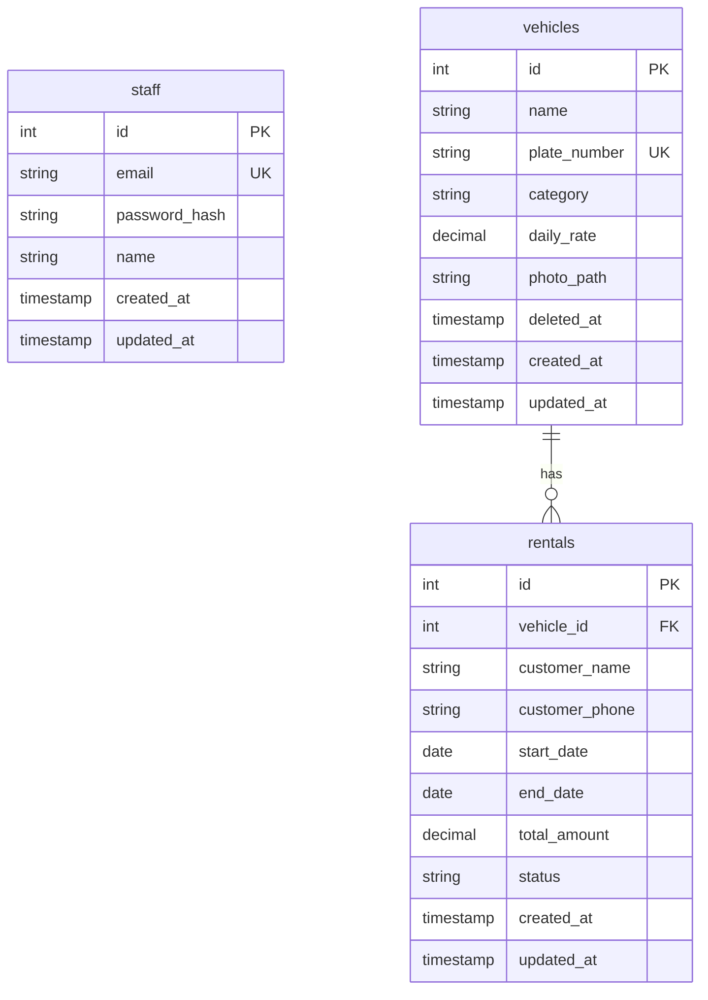

# Vehicle Rental Management System (Backend REST API)

An enterprise-grade, highly scalable, and modular REST API backend for a Vehicle Rental Management System. This system allows rental company staff to log in and manage the vehicle fleet, records customer bookings as rentals with high-concurrency distributed locking and event-driven batch processing, and provides detailed monthly rental activity reporting.

The system is architected around Node.js, TypeScript, PostgreSQL (with Knex.js), and features high-concurrency availability checks using Redis distributed locks, search/filtering via OpenSearch, local filesystem photo storage with configurable domain URLs, and event-driven batch processing with Binary Split DLQ fault isolation using Apache Kafka.

---

## Table of Contents
- [Features](#features)
- [System Architecture](#system-architecture)
- [Tech Stack](#tech-stack)
- [Project Structure](#project-structure)
- [Database Schema](#database-schema)
- [API Documentation](#api-documentation)
  - [Authentication](#authentication)
  - [Vehicles](#vehicles)
  - [Rentals](#rentals)
  - [Reports](#reports)
- [Business Logic & Technical Decisions](#business-logic--technical-decisions)
  - [Cache-First Vehicle Lookup & Automatic Rate Calculation](#cache-first-vehicle-lookup--automatic-rate-calculation)
  - [Distributed Concurrency Lock & Redis Slots](#distributed-concurrency-lock--redis-slots)
  - [Kafka Batch Processing & Single-Query Bulk Overlap Check](#kafka-batch-processing--single-query-bulk-overlap-check)
  - [Binary Split DLQ Strategy](#binary-split-dlq-strategy)
  - [Pro-Rata Monthly Report Calculation](#pro-rata-monthly-report-calculation)
- [Setup & Installation](#setup--installation)
  - [Prerequisites](#prerequisites)
  - [Environment Variables](#environment-variables)
  - [Docker & External Services Setup](#docker--external-services-setup)
  - [Database Migrations & Seeds](#database-migrations--seeds)
  - [Running the Application](#running-the-application)
- [Development & Quality Standards](#development--quality-standards)

---

## Features

- **Authentication & Security:** Multi-device staff login with Bcrypt password hashing, dual JWT tokens (Access Token & Refresh Token), RFC-compliant UUIDv7 `deviceId`, and active session tracking in Redis.
- **Vehicle Fleet Management:** CRUD operations for vehicles with multipart form-data photo uploads saved locally to disk (`uploads/vehicles/`) and returned with fully-qualified domain URLs (`APP_DOMAIN`). Soft deletion (`deleted_at`) preserves relational integrity.
- **Cursor Pagination:** `GET /vehicles` and `GET /rentals` implement lightweight, fast keyset cursor pagination returning `nextCursor` in response payloads.
- **Advanced Search & Filtering:** Vehicle search by name, category, and plate number is accelerated using **OpenSearch** to offload database search queries.
- **High-Concurrency Booking Engine (`/api/rentals`)**:
  - **Cache-First Vehicle Lookup:** Checks Redis `vehicle:{id}` cache first for vehicle details (`daily_rate`), falling back to DB and caching the result on cache miss.
  - **Automatic Backend `total_amount` Calculation:** Calculates `total_amount = daily_rate * duration_days` on the backend, omitting `total_amount` from client request bodies.
  - **Distributed Redis Lock:** Uses atomic `SET NX PX` with unique tokens and Lua script release to block concurrent booking collisions across multi-container deployments.
  - **Redis Availability Slot & TTL Strategy:** Checks date slot keys (`rental:slot:{vehicle_id}:{YYYY-MM-DD}`). Applies calculated TTLs per day (midnight end + 24h buffer) for automatic eviction. Released on rental cancellation or deletion.
  - **High-Throughput Kafka Batching:** Ingress queues rental requests to `rental-batch-queue`. Background consumer (`worker.ts`) flushes batches when reaching **100 items** OR a **2-second time window**.
  - **Single-Query Bulk Overlap Check:** Checks database collisions for all 100 batch items in 1 SQL query alongside in-memory intra-batch collision detection.
  - **Binary Split DLQ Strategy:** Recursively splits failing batches (divide & conquer) to isolate poisonous/corrupted records into `rental-dlq` while successfully committing all valid records in bulk.
- **Pro-Rata Monthly Reporting:** Calculates occupancy metrics (total bookings, days rented, revenue) broken down per vehicle for a requested calendar month, ensuring cross-month rentals are pro-rated accurately.

---

## System Architecture

The project follows a **Modular Feature Architecture** combined with a clean **OOP (Object-Oriented Programming)** structure.

```
                  ┌─────────────────────────────────┐
                  │          Client / HTTP          │
                  └────────────────┬────────────────┘
                                   │ (Express.js Routes)
                                   ▼
                  ┌─────────────────────────────────┐
                  │    Controllers (HTTP Parsing)   │
                  └────────────────┬────────────────┘
                                   │
                                   ▼
                  ┌─────────────────────────────────┐
                  │   Services (Business Logic)     │
                  └──────┬─────────┬───────────┬────┘
                         │         │           │
                         ▼         ▼           ▼
                  ┌──────────┐ ┌────────┐ ┌───────────┐
                  │   Redis  │ │  Kafka │ │OpenSearch │
                  │(Lock/Slot│ │(Batch/ │ │ (Search)  │
                  │  Cache)  │ │  DLQ)  │ │           │
                  └──────────┘ └────────┘ └───────────┘
                         │
                         ▼
                  ┌─────────────────────────────────┐
                  │   Repositories (Data Access)    │
                  └────────────────┬────────────────┘
                                   │ (Knex.js / Bulk Transactions)
                                   ▼
                  ┌─────────────────────────────────┐
                  │      PostgreSQL Database        │
                  └─────────────────────────────────┘
```

- **Modular Design:** Each domain (`auth`, `vehicles`, `rentals`, `reports`) is grouped together in `src/modules/` containing its controller, service, repository, interface, routes, and validation schemas.
- **Service Layer (OOP):** Route handlers delegate all business execution to Service classes. No business logic is placed inside the controller or routing layer.
- **Repository Pattern:** Database queries (SQL/Knex) are completely abstracted away from the Service layer into Repository classes.
- **Isolated Cache & Distributed Locks:** Domain-specific cache and distributed locking operations are encapsulated in `AuthCache`, `VehiclesCache`, and `RentalCache`.
- **Event-Driven Batch Processor:** Asynchronous background worker (`src/kafka/rental.handler.ts`) processes high-throughput rental batches with Binary Split DLQ fault isolation.

---

## Tech Stack

- **Runtime:** Node.js (v20+ LTS)
- **Language:** TypeScript
- **Framework:** Express.js
- **Query Builder & DB:** Knex.js & PostgreSQL
- **Caching & Distributed Locks:** Redis (Node-Redis) & RedisInsight UI
- **Search Engine:** OpenSearch
- **Message Broker:** Apache Kafka (`rental-batch-queue`, `rental-dlq`)
- **Validation:** Joi
- **File Storage:** Multer & Local Filesystem (`fs`) with configurable `APP_DOMAIN` and `UPLOAD_PATH`
- **Authentication:** JWT (Access & Refresh secrets) & Bcrypt
- **API Documentation:** Swagger / OpenAPI
- **Linter/Formatter:** ESLint & Prettier

---

## Project Structure

```text
src/
├── server.ts                 # HTTP Server Entry Point & Admin Topic Initializer
├── worker.ts                 # Kafka Worker/Consumer Entry Point
├── app.ts                    # Express App Setup & Static /uploads Middleware
├── app.container.ts          # Dependency Injection / Container
├── config/                   # Centralized configuration setup
│   ├── db.ts                 # Knex Connection Pool config
│   ├── env.ts                # Environment Variable validation (Joi)
│   ├── kafka.ts              # Kafka Client & Admin Topic Auto-Creation
│   ├── opensearch.ts         # OpenSearch Connection Client
│   ├── redis.ts              # Redis Connection Client
│   └── swagger.ts            # Swagger UI route setup
├── database/                 # Database migrations and seed scripts
│   ├── migrations/
│   └── seeds/
├── docs/                     # Swagger API documentation
│   └── swagger.json
├── kafka/                    # Event-driven batch processor & DLQ handler
│   └── rental.handler.ts     # Rental Batch Processor & Binary Split DLQ
├── middleware/               # Common HTTP Middlewares
│   ├── auth.middleware.ts    # JWT verification & Redis session check
│   ├── error.middleware.ts   # Global error handling
│   ├── upload.middleware.ts  # Multer memory storage middleware
│   └── validation.middleware.ts # Joi request body validator
├── modules/                  # Modular Feature Domains
│   ├── auth/                 # Authentication & Multi-Device Sessions
│   ├── vehicles/             # Vehicle Management, Caching & Search
│   ├── rentals/              # Rental Processing, Redis Slots & Locking
│   └── reports/              # Monthly activity analytics
└── utils/                    # Shared utility classes
    ├── appError.ts           # Standard Custom AppError wrapper
    ├── fileUpload.ts         # Local fs upload & delete helpers with APP_DOMAIN
    ├── sendResponse.ts       # Standard JSON response structure
    └── uuid.ts               # RFC-compliant UUIDv7 generator
```

---

## Database Schema



---

## API Documentation

Protected routes require JWT bearer token in header: `Authorization: Bearer <accessToken>`.

### Authentication
- `POST /api/auth/login`
  - **Body:** `{ email, password, deviceName }` (`deviceName` optional)
  - **Response:** `{ accessToken, refreshToken, deviceId, staff: { id, email, name } }`

### Vehicles
- `GET /api/vehicles` (Public)
  - **Query Parameters:** `cursor` (number), `limit` (number), `category` (string), `search` (string)

- `GET /api/vehicles/:id` (Public)
  - **Response:** Vehicle object fetched from Redis `vehicle:{id}` details cache or database.

- `POST /api/vehicles` (Staff Only)
  - **Headers:** `Content-Type: multipart/form-data`
  - **Body:** `name`, `plate_number`, `category`, `daily_rate` + optional file `photo`.

- `PUT /api/vehicles/:id` (Staff Only)
  - **Headers:** `Content-Type: multipart/form-data`
  - **Body:** Optional fields `name`, `plate_number`, `category`, `daily_rate` + optional file `photo`.

- `DELETE /api/vehicles/:id` (Staff Only)
  - **Action:** Soft-deletes vehicle (`deleted_at = NOW()`), purges Redis details cache, and removes document from OpenSearch.

### Rentals
- `POST /api/rentals` (Public / Staff)
  - **Body:**
    ```json
    {
      "vehicle_id": 1,
      "customer_name": "John Doe",
      "customer_phone": "+1234567890",
      "start_date": "2026-08-15",
      "end_date": "2026-08-20"
    }
    ```
  - **Action:** Checks Redis vehicle cache (`vehicle:{id}`) for `daily_rate`, calculates `total_amount` server-side, acquires Redis lock, checks/reserves Redis date slots, and dispatches payload to Kafka.

- `GET /api/rentals` (Staff Only)
  - **Query Parameters:** `limit` (default 10), `cursor` (number), `vehicle_id` (number), `status` (string), `start_date` (date), `end_date` (date).
  - **Response:** Keyset paginated object `{ rentals: [...], nextCursor: number | null }`.

- `GET /api/rentals/:id` (Staff Only)
  - **Response:** Detailed rental record by ID.

- `PUT /api/rentals/:id` (Staff Only)
  - **Body:** Optional fields `customer_name`, `customer_phone`, `start_date`, `end_date`, `status`.
  - **Action:** Recalculates `total_amount` if dates change, updates PostgreSQL record, and updates Redis slot keys.

- `DELETE /api/rentals/:id` (Staff Only)
  - **Action:** Deletes rental record from PostgreSQL and releases reserved Redis date slots (`rental:slot:{vehicle_id}:{date}`).

### Reports
- `GET /api/reports/rentals?month=YYYY-MM&vehicle_id=123`
  - **Parameters:** `month` (Required, format `YYYY-MM`), `vehicle_id` (Optional filter)

---

## Business Logic & Technical Decisions

### Cache-First Vehicle Lookup & Automatic Rate Calculation

To optimize rental creation and update latency:
1. **`RentalService` Checks Redis Cache First**: Looks up `vehicle:{id}` in Redis via `VehiclesCache.getVehicle(id)`.
2. **Database Fallback & Cache Hydration**: On a cache miss, queries PostgreSQL `vehicles` table and populates `vehicle:{id}` in Redis with a 1-hour TTL.
3. **Server-Side Total Calculation**: Calculates duration days:
   $$\text{Days} = \max\left(1, \left\lceil \frac{\text{end\_date} - \text{start\_date}}{86,400,000} \right\rceil + 1\right)$$
   Sets `total_amount = daily_rate * Days` automatically on the backend, protecting against client-side price tampering.

---

### Distributed Concurrency Lock & Redis Slots

For horizontal scalability across multi-container deployments:
1. **Distributed Lock (`RentalCache.acquireLock`)**:
   - Executes atomic `SET rental:lock:{vehicle_id}:{start_date}:{end_date} <token> NX PX 5000`.
   - Prevents parallel booking requests across microservice instances for the same vehicle and date range.
   - Released atomically via Lua script (`eval`) verifying token ownership.
2. **Date Slot Reservation (`RentalCache.reserveSlots`)**:
   - Key format: `rental:slot:{vehicle_id}:{YYYY-MM-DD}`.
   - Calculates TTL per date (`targetDateEnd - now + 24h buffer`) ensuring past slots automatically evict from Redis.
   - Released on cancellation or deletion via `RentalCache.releaseSlots`.

---

### Kafka Batch Processing & Single-Query Bulk Overlap Check

Background worker (`src/kafka/rental.handler.ts`) buffers incoming messages and flushes when reaching **100 items** OR **2 seconds** window:
1. **Intra-Batch Collision Check:** Evaluates whether two requests inside the same batch overlap with each other in memory.
2. **Single-Query Bulk DB Overlap Check (`findOverlappingRentalsBulk`)**:
   - Executes 1 SQL `SELECT` query with `OR` clauses across all 100 items instead of 100 separate queries in a loop, reducing DB latency by 99%.

---

### Binary Split DLQ Strategy

If a bulk insert fails due to database errors or date collisions:
- The `RentalBatchProcessor` recursively splits the failing batch in half (divide & conquer).
- Non-colliding sub-batches succeed and commit in bulk.
- Single poisonous records are isolated and routed to the Kafka Dead Letter Queue topic (`rental-dlq`), ensuring valid batch items are never dropped.

---

### Pro-Rata Monthly Report Calculation

When a rental crosses month boundaries (e.g., July 29 to August 3), the report calculates pro-rated occupancy and revenue within the requested month using:
```sql
GREATEST(0, (LEAST(end_date, :month_end) - GREATEST(start_date, :month_start)) + 1)
```

---

## Setup & Installation

### Prerequisites
- Node.js (v20 or higher)
- Docker & Docker Compose (Recommended)

### Environment Variables

Copy `.env.example` to `.env`:
```bash
cp .env.example .env
```

Configure `.env`:
```env
# Server Config
PORT=3000
NODE_ENV=development
JWT_ACCESS_SECRET=your_access_token_secret_key
JWT_REFRESH_SECRET=your_refresh_token_secret_key
APP_DOMAIN=http://localhost:3000
UPLOAD_PATH=uploads/

# Database Config (PostgreSQL)
DB_HOST=127.0.0.1
DB_PORT=5432
DB_USER=postgres
DB_PASSWORD=postgres
DB_NAME=vehicle_rental_db
DB_POOL_MIN=2
DB_POOL_MAX=10

# Redis Cache Config
REDIS_HOST=127.0.0.1
REDIS_PORT=6379
REDIS_PASSWORD=

# OpenSearch Config
OPENSEARCH_NODE=http://127.0.0.1:9200
OPENSEARCH_USER=admin
OPENSEARCH_PASSWORD=admin

# Kafka Broker Config
KAFKA_CLIENT_ID=rental-service
KAFKA_BROKERS=127.0.0.1:9092
KAFKA_GROUP_ID=rental-group
```

---

### Docker & External Services Setup

Start containers using Docker Compose:
```bash
docker compose up --build -d
```

---

### Database Migrations & Seeds

1. **Run Migrations:**
   ```bash
   npm run db:migrate
   ```
2. **Seed Database:**
   ```bash
   npm run db:seed
   ```

---

### Running the Application

```bash
# Install Dependencies
npm install

# Run HTTP API Server and Kafka Worker Concurrently
npm run dev

# Run Production Build
npm run build
npm start
```

#### Web Interfaces & Management UIs
- **Swagger OpenAPI Docs:** `http://localhost:3000/docs`
- **RedisInsight Web UI:** `http://localhost:5540`

---

## Development & Quality Standards

- **Formatting:** `npm run format`
- **Linting:** `npm run lint`
- **TypeScript Check:** `npx tsc --noEmit`
